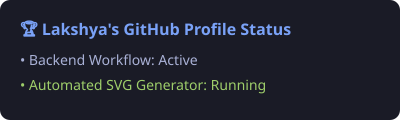

### 🚀 Frontend & Full-Stack Developer
*Building sleek UI/UX, AI applications, and cloud-native projects.*

---

### 🛠️ Languages & Frameworks

---

### 🧰 Cloud, Databases & Developer Tools

---

### ⚡ System Status & Dev Focus

---

### 📊 Commit Activity & Streak Metrics

  

